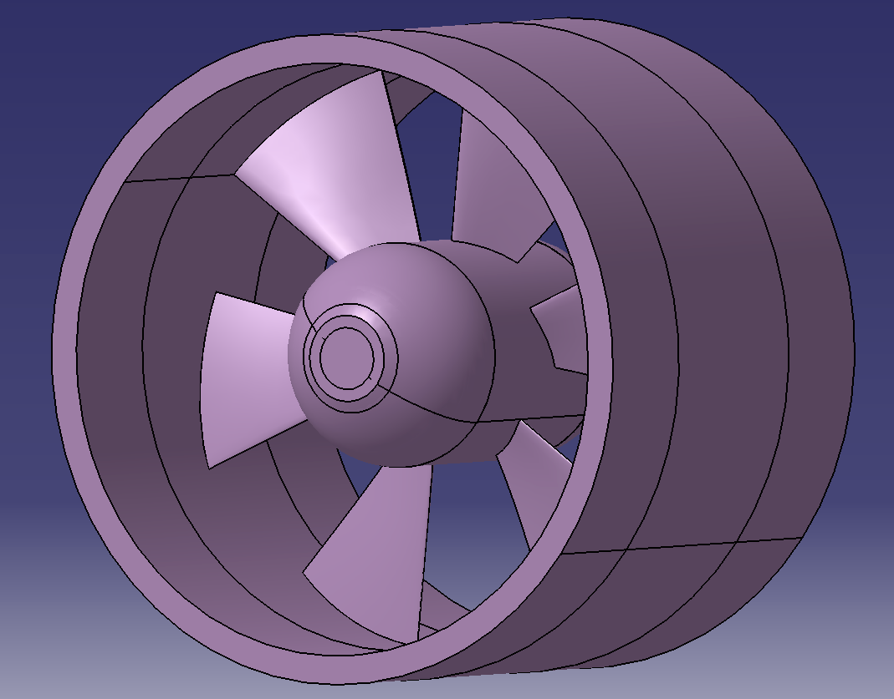
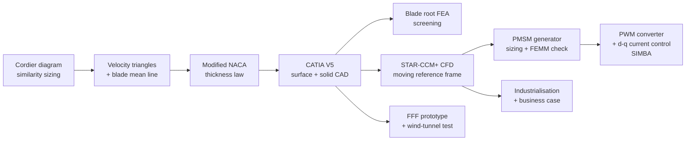
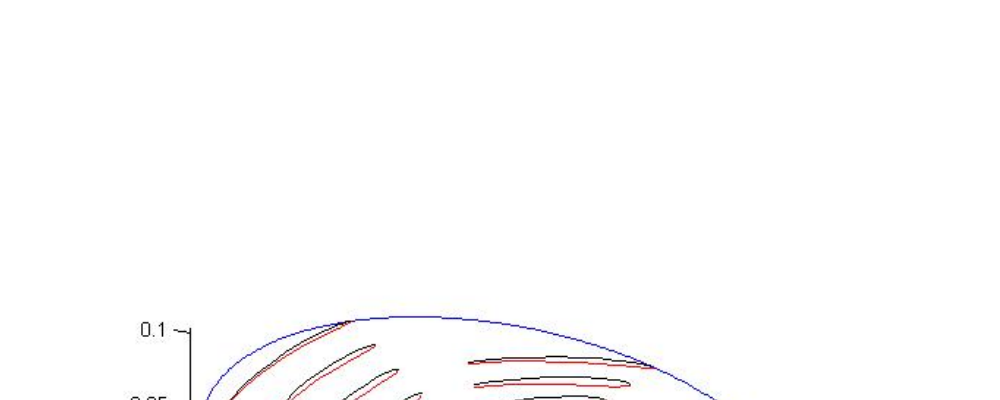
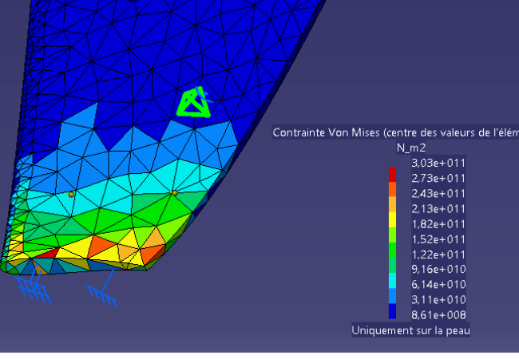
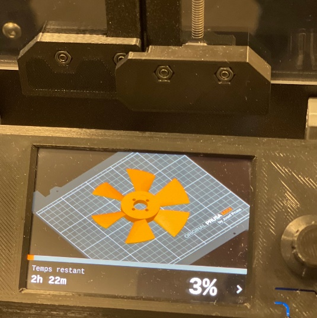
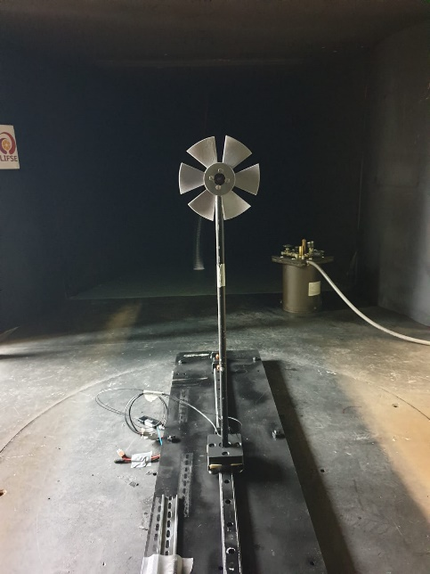

# Compact Axial Hydraulic Turbine — Integrated Turbomachinery Design

<p align="center">
  
</p>

<p align="center">
  <em>Hydraulic sizing &middot; CAD &amp; structural verification &middot; CFD &middot; electromechanical conversion &middot; additive-manufacturing prototyping &middot; industrialisation</em>
</p>

<p align="center">
  <a href="#"></a>
  <a href="#"></a>
  <a href="#"></a>
  <a href="#"></a>
  <a href="#"></a>
  <a href="#"></a>
  <a href="#"></a>
  <a href="#"></a>
</p>

<p align="center">
  <a href="docs/Compact_Axial_Hydraulic_Turbine_Report.pdf"></a>
</p>

## Overview

This repository documents the end-to-end engineering design of a **compact axial (Kaplan-type) hydraulic turbine**, carried out as a multidisciplinary study (*Bureau d'Etudes*) at **Arts et Metiers ParisTech (ENSAM)**. The project follows a single design thread from first principles to an industrial deployment scenario:

1. **Hydraulic preliminary sizing** in MATLAB, using similarity parameters and a digitised Cordier diagram.
2. **Blade-row and CAD modelling** in CATIA V5, with a preliminary finite-element check of the blade root.
3. **CFD analysis** in STAR-CCM+ (moving-reference-frame, steady segregated flow) to extract power, efficiency, and cavitation-risk trends.
4. **Electromechanical conversion**: a surface-mounted permanent-magnet synchronous generator pre-sized analytically and cross-checked with **FEMM/OctaveFEMM**, driving a PWM voltage-source converter modelled in **SIMBA**.
5. **Additive-manufacturing prototyping** (FFF, PLA) and **wind-tunnel testing** as a reduced-scale aerodynamic analogue of the hydraulic runner.
6. **Industrialisation study**: production planning, make-or-buy, location strategy, and a discounted business case for a 167-unit modular fleet.

The full write-up is included in [`docs/Compact_Axial_Hydraulic_Turbine_Report.pdf`](docs/Compact_Axial_Hydraulic_Turbine_Report.pdf).

> This was a **team project** (group GIE2-ED2, Semester 7): **Dev Kumar, Thien Ho, Seyf Daab, Wilhem Abboura**, supervised by **Christophe Sarraf, Florent Ravelet, Pascal Caestecker,** and **Jean-Frederic Charpentier**. This repository packages the MATLAB, FEMM, and SIMBA source files together with the consolidated report for portfolio purposes; the FEMM base template (`electromagnetic/femm`) was originally provided by J.-F. Charpentier and parameterised here for the project's operating point.

## Key results

| Stage | Metric | Value |
|---|---|---|
| Hydraulic design point | Speed / head / flow rate | 1500 rpm &middot; 3.8 m &middot; 0.132 m&sup3;/s |
| Runner envelope | Outer / hub radius | 103 mm / 39.1 mm |
| CFD baseline mesh | Cells / faces / vertices | 61,518 / 279,251 / 187,548 |
| CFD best operating point | Mechanical power @ flow rate | ≈ 1760 W @ 0.144 m&sup3;/s |
| Generator design torque | Electromagnetic torque | 152 N&middot;m |
| Prototype (wind-tunnel analogue) | Max. power coefficient / efficiency | C<sub>p</sub> ≈ 0.239 / η ≈ 0.56 |
| Industrial scenario | Fleet size / annual output | 167 units / ≈ 2 TWh/yr |
| Business case | ROI / payback | 21.5% / 2.4 years |

## Methodology



### Hydraulic sizing

The runner is sized from the engineering specific speed and the Cordier diagram:

```
Nsq = N * sqrt(qv) / H^0.75          (specific speed)
Omega = pi * Nsq / (30 * g^0.75)     (dimensionless specific angular velocity)
```

with the design point **N = 1500 rpm, N<sub>sq</sub> = 200, H = 3.8 m, q<sub>v</sub> = 0.132 m&sup3;/s**, giving an outer radius R<sub>e</sub> = 0.103 m and a hub radius R<sub>i</sub> = 0.039 m (hub-to-tip ratio 0.38).

Local velocity triangles then follow from the Euler turbine equation:

```
U(r)      = omega * r
Cu2_th(r) = -g*H / U(r)
beta_1(r) = atan( U(r) / Ca )
beta_2(r) = atan( (U(r) - Cu2(r)) / Ca )
```

### Electromechanical conversion

The generator's average electromagnetic torque follows from the fundamental air-gap flux density and the linear current loading:

```
<Cem> = sqrt(2) * B1 * A * V * cos(Psi)          (V = bore volume, A = linear current loading)
```

which is maximised for Ψ = 0 (current aligned with the EMF). The associated PWM converter is analysed for carrier-frequency sensitivity and closed-loop *d-q* current control.

## Repository structure

```
.
├── docs/
│   └── Compact_Axial_Hydraulic_Turbine_Report.pdf   # full write-up
├── matlab/
│   ├── hydraulic_sizing/     # Cordier sizing, velocity triangles, blade geometry, CATIA export
│   └── data_reduction/       # test-bench characteristic curves, affinity-law scaling
├── electromagnetic/
│   └── femm/                 # OctaveFEMM parametric PMSM field/flux/inductance script
├── simulink_simba/           # PWM converter + d-q current-control model (SIMBA)
├── cad/                      # STEP fluid-domain geometry used for the CFD study
├── data/                     # test-bench characteristic-curve dataset (multi-speed)
└── assets/                   # figures used in this README
```

## Tools and languages

| Domain | Tool |
|---|---|
| Hydraulic sizing, data reduction | MATLAB |
| Blade-section aerodynamics | XFoil |
| 3-D CAD, surfacing, structural screening | CATIA V5 (Generative Shape Design, Part Design, FEA) |
| CFD | Simcenter STAR-CCM+ |
| Electromagnetic field solving | FEMM / OctaveFEMM |
| Power electronics & control | SIMBA |
| Additive manufacturing | PrusaSlicer, FFF (PLA) |
| Experimental validation | Recirculating wind tunnel, 6-component balance |

## Selected figures

<table>
<tr>
<td><br><sub>Final blade-row geometry exported from the hydraulic sizing script</sub></td>
<td><br><sub>Blade-root equivalent-stress distribution (finite-element screening)</sub></td>
</tr>
<tr>
<td><br><sub>FFF-printed PLA runner prototype</sub></td>
<td><br><sub>Prototype installed in the recirculating wind-tunnel test section</sub></td>
</tr>
</table>

## Running the MATLAB scripts

```
matlab/hydraulic_sizing/main_turbine_sizing.m      % full sizing pipeline + CATIA point-cloud export
matlab/hydraulic_sizing/fit_naca_thickness.m       % modified NACA thickness-law identification (requires an XFoil point-save file)
matlab/hydraulic_sizing/cordier_digitisation.m     % Cordier-diagram specific-radius lookup
matlab/data_reduction/characteristic_curve_reduction.m   % reduces data/RIM_test_bench_data.xlsx into head/efficiency curves and BEPs
matlab/data_reduction/affinity_law_scaling.m       % turbine affinity-law speed scaling example
```

The FEMM script (`electromagnetic/femm/pmsm_femm_field_analysis.m`) requires a local [FEMM](http://www.femm.info/) installation and the OctaveFEMM/MATLAB toolbox; update the `addpath` at the top of the file to your installation directory before running.

The SIMBA model (`simulink_simba/pwm_converter_speed_control.jsimba`) can be opened directly in [SIMBA](https://simba.education/).

## License

This project is released under the [MIT License](LICENSE).

## Contact

Dev Kumar &middot; [dev-kumar.com](https://dev-kumar.com) &middot; contact@dev-kumar.com
